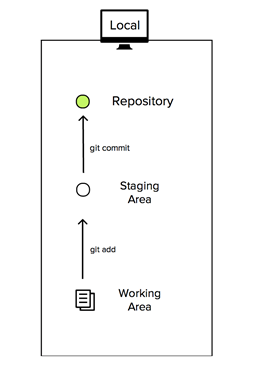
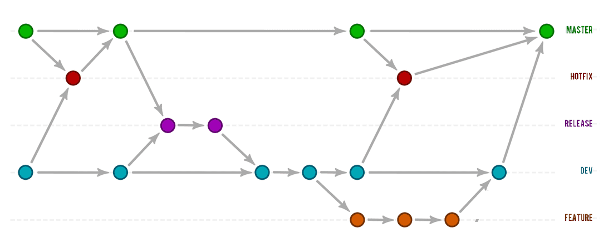

# Taller GIT & GITHUB Temario
**Tabla de Contenidos**

- [Taller GIT & GITHUB Temario](#taller-git---github-temario)
  * [Qué es MarkDown](#qu--es-markdown)
  * [GIT vs GITHUB](#git-vs-github)
  * [Descargar Sitio de pruebas](#descargar-sitio-de-pruebas)
  * [GitHub Introducción](#github-introducci-n)
  * [GIT](#git)
    + [Descargar e Instalar GIT](#descargar-e-instalar-git)
    + [Configuración Inicial de GIT | git  config](#configuraci-n-inicial-de-git---git--config)
    + [Niveles de GIT Config](#niveles-de-git-config)
    + [Historial de Configuraciones](#historial-de-configuraciones)
  * [GIT & Bash Commands](#git---bash-commands)
    + [Comandos básicos de Bash](#comandos-b-sicos-de-bash)
    + [GIT Init - Incializar nuestro repositorio](#git-init---incializar-nuestro-repositorio)
    + [Composición de un Repositorio Local](#composici-n-de-un-repositorio-local)
    + [GIT Status](#git-status)
    + [GIT Add](#git-add)
    + [GIT rm --cached](#git-rm---cached)
    + [GIT Commit](#git-commit)
    + [GIT Log](#git-log)
      - [Desplegará el número de commits en el parametro](#desplegar--el-n-mero-de-commits-en-el-parametro)
    + [GIT Remote y Repositorios Remotos](#git-remote-y-repositorios-remotos)
      - [Ver repositorios remotos](#ver-repositorios-remotos)
    + [Agregar nuestros repositorios remotos vacíos](#agregar-nuestros-repositorios-remotos-vac-os)
    + [GIT KEY GEN | Generando Nuestra Llave SSH](#git-key-gen---generando-nuestra-llave-ssh)
      - [Por defecto tendrán este nombre la llave publica y privada](#por-defecto-tendr-n-este-nombre-la-llave-publica-y-privada)
      - [Podemos verificar si tenemos llaves creadas en ese directorio o accediendo en la terminal con:](#podemos-verificar-si-tenemos-llaves-creadas-en-ese-directorio-o-accediendo-en-la-terminal-con-)
      - [Si no las vemos vamos a generarlas.](#si-no-las-vemos-vamos-a-generarlas)
      - [Obtener llave publica para usar en GitHub](#obtener-llave-publica-para-usar-en-github)
    + [GIT Push](#git-push)
    + [Branches o Ramas en GIT](#branches-o-ramas-en-git)
    + [GIT Checkout - Movernos en el Tiempo entre Commits](#git-checkout---movernos-en-el-tiempo-entre-commits)
    + [GIT Push Origin Branch](#git-push-origin-branch)
    + [GIT Merge - Fusionando Branches](#git-merge---fusionando-branches)
    + [Problemas cuando hacemos Manual Merge](#problemas-cuando-hacemos-manual-merge)
    + [GIT Ignore - Ignorando archivos](#git-ignore---ignorando-archivos)
    + [GIT Clone - Clonando un repositorio remoto](#git-clone---clonando-un-repositorio-remoto)
    + [Trabajar Colaborativamente con GIT y GitHub](#trabajar-colaborativamente-con-git-y-github)
    + [GIT ALIAS](#git-alias)
    + [GitHub Pages](#github-pages)
    + [Problemas comunes con GitHub Pages.](#problemas-comunes-con-github-pages)

<small><i><a href='http://ecotrust-canada.github.io/markdown-toc/'>Table of contents generated with markdown-toc</a></i></small>


---


Recomendaciones.
- Todos usar los mismos archivos, nombres de archivos etc


---

## Qué es MarkDown 

Markdown es un lenguaje de marcado ligero.

*MarkDown lo utilizamos para doumentar nuestros repositorios con archivos README.md con extensión md de MarkDown*
>[Guía MarkDown](https://www.markdownguide.org/getting-started/)

## GIT vs GITHUB
- Qué es Git?

Git es un sistema de control de versiones.

Un sistema de control de versiones nos va a servir para trabajar en equipo de una manera mucho más simple y optima cuando estamos desarrollando software.

Con Git vamos a poder controlar todos los cambios que se hacen en nuestra aplicación y en nuestro código y vamos a tener control absoluto de todo lo que pasa en el código, pudiendo volver atrás en el tiempo, pudiendo abrir diferentes ramas de desarrollo, etc.

[Leer más](https://victorroblesweb.es/2018/04/28/que-es-git-y-para-que-sirve/)

- Qué es GitHub?

Github es un portal creado para alojar el código de las aplicaciones de cualquier desarrollador. La plataforma está creada para que los desarrolladores suban el código de sus aplicaciones y herramientas, y que como usuario no sólo puedas descargarte la aplicación, sino también entrar a su perfil para leer sobre ella o colaborar con su desarrollo.

[Leer más](https://www.xataka.com/basics/que-github-que-que-le-ofrece-a-desarrolladores)


- Diferencias

En pocas palabras GIT es nuestro sistema control de versiones instalado localmente en nuestro pc y GitHub es un tipo de red social donde compartimos con todos o con las personas de nuestro grupo u organización nuestros códigos para trabajar colaborativamente integrado con GIT 

---

## Descargar Sitio de pruebas
>[Descarga el Sitio de pruebas](https://html5up.net/solid-state/download)

---

## GitHub Introducción

- Registrarnos en GitHub
>[Registrate aquí](https://github.com/)

- Crear Repositorios remotos en GitHub

1. Nombre del repositorio en minuscula.

2. Repositorio con readme inluido.

3. Repositorio vacío.

---
## GIT

>[Documentación de GIT](https://git-scm.com/book/en/v2)

### Descargar e Instalar GIT
>[Descargar GIT](https://git-scm.com/downloads)

Podemos comprobar que GIT se instaló éxito abriendo la terminal de **GIT BASH** en el menú de inicio lo buscamos y abrimos.
También podemos abrir la carpeta donde queremos trabajar y dar clik derecho y buscar la opción de  GIT **Bash Here** y abrirá la terminal en esa ruta.

Una vez estando en GIT Bash escribimos el comando:


````
git --version
````
Este nos debe desplegar la versión instalada.

---


### Configuración Inicial de GIT | git  config
Tenemos que decirle a GIT quienes somos con nuestro nombre o nickname y nuestro correo que utilizamos en nuestro GitHub
`````
Indicamos nuestro nombre
git config --global user.name "Peter Parker"

Indicamos nuestro email asociado con GitHub
git config --global user.email peter@webhead.com
`````

---

### Niveles de GIT Config
Hay 3 niveles en GIT Config estos son: system, global, local

System: configuración esta disponible para todos los proyectos para todos los usuarios.

Global: configuración esta disponible para todos los proyectos para el usuario actual y esta almacenado en:`

````
	global path: 
    C:\Users\YourName\.gitconfig

		Hay un archivo llamado .gitconfig con nuestra configuración
````

Local: configuración esta disponible para el proyecto actual y esta almacenado en:

Es el archivo config en la carpeta .git de nuestro repositorio

`````
yourRepository/.git/config
`````

### Historial de Configuraciones

`````
Podemos ver la configuración de GIT con estos comandos:

`````

`````
Podemos ver las rutas de system, global etc
git config --list --show-origin
`````

`````
Solo configuraciones usadas
git config --list 
`````

---

## GIT & Bash Commands
[101 Bash Commands and Tips for Beginners to Experts ](https://dev.to/awwsmm/101-bash-commands-and-tips-for-beginners-to-experts-30je)

### Comandos básicos de Bash
``````
- Entrar a la Carpeta
  cd nombreCarpeta 

- Ir hacia atras en el Carpeta
    cd ../ 

- Listar archivos de la carpeta actual
    ls 

-   Abrir archivo en editor de codigo VSCode
    code nombreArhivo.html

-   Crear Archivos
    touch nombreArchivo.txt

-   Crear Carpeta
    mkdir nombreCarpeta 

-   Eliminar Carpeta vacio
    rmdir nombreCarpeta 

-   Eliminar Carpeta y archivos de forma recursiva
    rm -r nombreCarpeta

``````

### GIT Init - Incializar nuestro repositorio

[git init docs](https://git-scm.com/docs/git-init)

En una carpeta vamos abrir git bash.

Hacemos click derecho dentro de una carpeta y selecionamos:

`````
git bash here
`````

Una vez tengamos la terminal de GIT abierta en nuestro directorio o carpeta utilizamos el comando: 

`````
git init
`````
Esto inicializa nuestro repositorio o reinicia

### Composición de un Repositorio Local



**Working Area o Working Tree:**
Acá estan todos los archivos de nuestro proyecto que aún se estan trabajando y no han sido agregados al *staging area* por lo general aparecen con un status *untracked*.
Es como el borrador de nuestro sitio o aplicación.
Podemos modificar y eliminar los archivos presentes acá, hasta que decidamos agregarlos al *staging area*

**Staging Area - Index or Cache:**
Acá estan todos los archivos de nuestro proyecto que fueron agregados y estan listos para formar parte de un nuevo *commit* 

**Qué es un commit:** es un punto guardado en el tiempo, con ello guardamos todos esos cambios en nuestro repositorio. Nuestro repositorio almacena todos los commits.

[Leer más](https://frontendmasters.com/courses/git-in-depth/working-area-staging-area-repository/)


---

### GIT Status
[git status docs](https://git-scm.com/docs/git-status)

El comando git status muestra el estado del *working area o working tree* entre los archivos que estan siendo rastreados y los que no y salen con el estado *untracked*

``````
git status
``````

---

### GIT Add
[git add docs](https://git-scm.com/docs/git-add)

El comando git add sirve selecionar mis archivos del *working area* y enviarlos al  *staging area* de esta forma git los podrá rastrear y estos podran formar parte de un nuevo commit.

`````
Agrega todos los archivos
    git add -A

Agrega el archivo con el nombre especifico en la carpeta actual
    git add index.html

`````

### GIT rm --cached

Así como agregamos los archivos al *staging area* podemos quitarlos de ahí si lo necesitamos con el comando

```````
git rm --cached nombreArchivoAgregado.html
```````

### GIT Commit
[git commit docs](https://git-scm.com/docs/git-commit)

El comando git commit sirve para guardar los cambios que estan en nuestro *staging area* en el repositorio, este recibe una descripción del commit para saber de que se trata el cambio realizado.


`````
git commit -m "bug fix del footer en los enlaces rotos de redes sociales"

-m significa message
`````

---

### GIT Log
[git log docs](https://git-scm.com/docs/git-log)

Este comando nos muestra todos los commits realizados e información de su commit ID, quien hizo el commit, fecha, su mensaje -m, información muy importante como el HEAD que es el commit donde nos ubicamos, la rama o branch en la que estamos, etc.

``````
git log
``````

Si hay muchos commits solo se desplegará una cantidad de ellos si se quieren ver los demás se debe presionar la tecla **espacio** y si se desea salir de la vista de los commits por ser demasiados se puede presionar la tecla **q** para salir y poder escribir nuevamente  en la terminal.

#### Desplegará el número de commits en el parametro
``````
git log -7

``````

### GIT Remote y Repositorios Remotos

[git remote docs](https://git-scm.com/docs/git-remote)

Con git remote podemos agregar un repositorio remoto a nuestro repositorio local y que estos esten conectados, además podemos ver los repositorios remotos agregados a nuestro repositorio local.

#### Ver repositorios remotos

````
git remote -v 
````

### Agregar nuestros repositorios remotos vacíos


Origin le llamamos por defecto al repositorio que está en GitHub o sea al repositorio remoto. Por eso le decimos a git que agregue un repositorio remoto llamado origin y le indicamos la dirección ssh vinculada a ese repositorio.

````
git remote add origin [dirección SSH repo remoto]
````
Para enviar nuestros cambios al repositorio remoto:

- Agregamos la dirección ssh de nuestro repositorio remoto en nuestro repositorio local.
- Agregamos algun archivo.
- Hacemos un commit
- Hacemos git push origin main

Si tenemos la llave ssh configurada subiria nuestro proyecto.

### GIT KEY GEN | Generando Nuestra Llave SSH

[ssh -keygen docs](https://git-scm.com/book/en/v2/Git-on-the-Server-Generating-Your-SSH-Public-Key)

Nuestra llaves ssh generadas van a estar en la siguiente ubicación:

>C:\Users\YourName\.ssh

#### Por defecto tendrán este nombre la llave publica y privada
>id_rsa

>id_rsa.pub


#### Podemos verificar si tenemos llaves creadas en ese directorio o accediendo en la terminal con:

````
cd ~/.ssh

ls
````

#### Si no las vemos vamos a generarlas.

````
ssh-keygen -o

````
Se nos presentará este mensaje.

````
Generating public/private rsa key pair.
Enter file in which to save the key (/home/schacon/.ssh/id_rsa):
Created directory '/home/schacon/.ssh'.
Enter passphrase (empty for no passphrase):
Enter same passphrase again:
Your identification has been saved in /home/schacon/.ssh/id_rsa.
Your public key has been saved in /home/schacon/.ssh/id_rsa.pub.
The key fingerprint is:
d0:82:24:8e:d7:f1:bb:9b:33:53:96:93:49:da:9b:e3 schacon@mylaptop.local
````

Podemos elegir ponerle contraseña o no.

#### Obtener llave publica para usar en GitHub

````
cat ~/.ssh/id_rsa.pub

````

Si le pusimos un nombre diferente a nuestras llaves utilizar ese en el comando cat

Nos devolverá un mensaje como este:

````
ssh-rsa AAAAB3NzaC1yc2EAAAABIwAAAQEAklOUpkDHrfHY17SbrmTIpNLTGK9Tjom/BWDSU
GPl+nafzlHDTYW7hdI4yZ5ew18JH4JW9jbhUFrviQzM7xlELEVf4h9lFX5QVkbPppSwg0cda3
Pbv7kOdJ/MTyBlWXFCR+HAo3FXRitBqxiX1nKhXpHAZsMciLq8V6RjsNAQwdsdMFvSlVK/7XA
t3FaoJoAsncM1Q9x5+3V0Ww68/eIFmb1zuUFljQJKprrX88XypNDvjYNby6vw/Pb0rwert/En
mZ+AW4OZPnTPI89ZPmVMLuayrD2cE86Z/il8b+gw3r3+1nKatmIkjn2so1d01QraTlMqVSsbx
NrRFi9wrf+M7Q== schacon@mylaptop.local
````

Este código lo copiamos y pegamos en nuestro perfil de git en la direccón de:
>https://github.com/settings/keys

Presionamos el botón de:
>New SSH Key

Escribimos una descripción de esa llave que estará vinculada con nuestro PC y pegamos la llave copiada.


---

### GIT Push
[git push docs](https://git-scm.com/docs/git-push)

Una vez creado nuestro repositorio remoto en GitHub, configurado nuestro remote (git remote add origin [ssh]), y creado nuestra llave SSH, ahora podemos enviar nuestros cambios con *push* a nuestro remote o repositorio remoto con el comando:

````
git push origin main
````
Básicamente le estamos diciendo que enviemos todos nuestros commits de nuestra rama principal llamada **main** hacia nuestro repositorio remoto llamado **origin**

---

### Branches o Ramas en GIT 
Siempre vamos a tener una rama o branch principal en nuestros repositorios, esta rama por defecto se llama **main** pero podemos tener otras ramas o branches con los nombres que queramos para trabajar diferentes versiones del proyecto.

Podemos tener la branch principal para todos esos cambios que consideremos como definitivos y otra rama para ir desarrollando la cual podemos nombrar como **development** otra para arreglar bugs, otra más para aplicar responsive design a nuestro sitio y demás.
Podemos crear las ramas que queramos desde cualquier punto del proyecto.



La idea de las ramas es poder trabajar en el proyecto sin modificar aún la rama principal o alguna otra que este utilizando otro desarrollador, y cuando esté lista para integrarse poderla fusionar con alguna otra rama para que conserven sus cambios o podamos elegir cuales cambios queremos en caso que se haya atacado las mismas líneas de código.

Estas ramas o branches pueden o no ser fusionadas, dependiendo de lo que queramos.

Cualquier branch puede ser creada en cualquier momento del proyecto.

¿Cómo como crear Branches?

Hay dos comandos para este fin uno de ellos nos va a cambiar a esa rama inmediatamente al crearla, o sea que ya no estaríamos ubicados en la rama principal llamada main sino en la que acabamos de crear, este comando es:

````
git checkout -b BranchName
````
-b significa branch.

El otro comando nos crea la rama pero no nos lleva a esta solamente la crea.

````
git branch nombreBranch
````

---

### GIT Checkout - Movernos en el Tiempo entre Commits

Este comando nos permite movernos entre commits y entre branches para acceder al proyecto en algun momento del tiempo, por ejemplo acceder a partes iniciales del proyecto, partes eliminadas y hasta podemos crear branches y movernos a ellas.

`````
git checkout [commit ID]
git checkout [BranchName]
`````

---

### GIT Push Origin Branch

Las ramas nuevas creadas no van a ser visibles para los demás o para el repositorio remoto sino las subimos o hacemos push explicitamente.

````
git push origin [development]
````

development sería una rama creada aparte de la rama por defecto llamada main

---


### GIT Merge - Fusionando Branches

Cuando creamos una branch en cierto momento es posible que queramos que todos esos cambios se integren a la rama principal o alguna otra rama para ello debemos hacer un **Merge o Fusión**.

Es importante saber que rama es que vaya a absorber los cambios de la otra, ya que nos tenemos que posicionar en la rama que absorverá a la otra, para posicionarnos usamos **git checkout branchName**.

Una vez ubicados en la branch que queremos que absorba los cambios vamos a usar el comando:

````
git merge branchName
````
Esto procederá a realizar una fusión y puede haber 2 eventos:

- **FastForward**: este nos indica que no hubo ningún tipo de conflicto entre archivos o líneas de código y todo se fusionó perfectamente.

- **Manual Merge**: es lo que ocurre cuando en ambas ramas se realizaran modificaciones afectando las mismas líneas de código ¿que pasa con esto? Sencillo, Git te pedirá que elijas con cual fragmento de código (cambio) te quedarás y lo dividirá con unas flechas, por ejemplo:

````
 <<<<<< **[Rama A]**
 **[Aquí estará el código de la modificación  número 1]**
 =====
 **[Aquí estará el código de la modificación  número 2]**
 >>>>> **[Rama B]**
````


### Problemas cuando hacemos Manual Merge

A veces se nos pedirá un mensaje para el merge que estamos haciendo, y la consola entrará en un modo distinto.

Para escribir en este modo podemos dar click en la tecla **i** para entrar al modo de **Insert** y poder escribir.

Una vez terminemos podemos dar a la tecla **ESC** y luego **:w** para guardar.

Por último y salir de ese modo la tecla **:q** y salir.

Más información en el siguiente enlace: 
[Leer más](https://www.tecmint.com/exit-file-in-vi-vim-editor-in-linux/)

--- 

### GIT Ignore - Ignorando archivos

Muchas veces no queremos que git haga el rastreo o tenga en cuenta algunos archivos que nuestro editor de código o IDE pueda crear, además de paquetes como los que se crean en un proyecto de node node_modules o simplemente archivos de imagenes o de pruebas que no queramos agregar a nuestro repositorio local y mucho menos vayan a nuestro repositorio remoto en GitHub.

Para ello existe un archivo que podemos crear con todas las rutas de las carpetas que queremos ignorar o tipos de archivos. Incluso existen archivos predeterminados según el tipo de proyecto que estemos trabajando que contiene predeterminadamente todas las instrucciones de archivos a ignorar y nosotros podemos agregarle extras.

````
.gitignore
````

Este archivo podemos abrirlo en nuestro editor y decirle  que carpetas y archivos ignorar.

Ejemplo

````
imagenes/
node_modules/
.txt
````

Esto le diría a git que ignore la carpeta de *imagenes*, *node_modules* y todos los archivos con extensión *.txt*

---

### GIT Clone - Clonando un repositorio remoto

No siempre vamos a tener un repositorio vacío el cual inicializar como se hizo anterior mente, muchas veces puede ser un repositorio ya existente con archivos y demás.

Para ello podemos clonar ese archivo y trabajar en este ya sea para colaborar con este repositorio si tenemos los permisos o sea nuestro.

Para clonarlo necesitamos la dirección SSH del repositorio remoto puede lucir algo así:

````
git@github.com:YourGitHubName/YourRepositoryName.git
````

También se puede mediante https o github cli.

Obtener esta direccón es sencillo vamos al repositorio en Github y habrá un boton llamado [CODE] damos click y nos aparecen estas opciones para copiar esta dirección SSH y hasta para descargar en .zip

Copiamos la dirección SSH y le damos la siguiente instrucción a GIT:

````
git clone git@github.com:YourGitHubName/YourRepositoryName.git
````

GIT descargará el repositorio en la carpeta y ahora podremos trabajar con este repositorio y hacer push si es nuestro o tenemos los permisos en caso de trabajar con alguien más.

---

### GIT Fetch

Siempre vamos a tratar de tener los repositorios locales y remotos iguales, con los mismos archivos o cambios, en el momento en que no sean iguales vamos a actualizar el antiguo con el más nuevo.

Por ejemplo cuando el repositorio local creamos algo nuevo y el repositorio remoto en GitHub no tiene esos cambios lo actualizamos haciendo **push** de nuestros nuevos commits.

De igual forma, si el repositorio remoto en GitHub tuviera cambios nuevos ya sea por que creamos un archivo en el sitio web o estamos trabajando colaborativamente con alguien más e hizo un *push* al repositorio remoto, entonces este remoto estaría más actualizado o tendría cambios que nuestro repositorio local no tiene, por esta razón tenemos que hacer que sean iguales para seguir haciendo *push*, ahí es donde entra **fetch** y **merge** para descargar los cambios, fusionarlos para dejar todo igual y poder hacer nuevamente **push**.


Cuando el repositorio remoto en GitHub tiene cambios nuevos y nuestro repositorio local en nuestra computadora no tiene esos cambios, entonces descargamos los cambios nuevos utilizando el comando:

````
git fetch 
````

Fetch descargará los nuevos cambios del remoto en una rama escondida que existe por defecto llamada ***origin/main***.

````origin/main````

Una vez descargados los cambios en origin/main podemos situarnos en nuestra rama main o la que queremos que reciba los cambios y hacer un ***git merge origin/main*** y hacer la fusion de estos.

````
git merge origin/main
````

Una vez terminada la fusión y hecho el commit de este podemos enviar la nueva versión del proyecto fusionado hacia GitHub con ***git push origin main***
como originalmente lo hacíamos.

````
git push origin main
````

---

### Trabajar Colaborativamente con GIT y GitHub

Si vamos a trabajar con alguien más y confiamos en esta persona podemos darle permisos para que realice los mismos cambios que nosotros al repositorio. Para esto debemos ir a estas opciones en nuestro repositorio y concederle permisos.


Nos dirigimos a las opciones del repositorio y entramos a *access*.

````
https://github.com/YourName/YourRepository/settings
https://github.com/YourName/YourRepository/settings/access
````

Una vez ahí Invitamos a un colaborador con su User Name o email.

Esta persona podrá clonar tu repositorio y usar sus credenciales para hacer push y enviar cambios a tu repositorio en GitHub.

---

### GIT ALIAS

>NiceLog

``````
git config --global alias.nicelog 'log --oneline --graph --all'
``````

>Git Log: SuperLog
contiene graficas, abreviaturas, fechas, colores para branches, decorados

``````
git config --global alias.superlog "log --graph --abbrev-commit --decorate --date=relative --format=format:'%C(bold blue)%h%C(reset) - %C(bold green)(%ar)%C(reset) %C(white)%s%C(reset) %C(dim white)- %an%C(reset)%C(bold yellow)%d%C(reset)' --all"
``````


>Git Log: git lg 
``````
git config --global alias.lg "log --oneline --decorate --all --graph"
``````

>Git Status: git s
``````
git config --global alias.s "status -s -b"
``````

---

### GitHub Pages

Podemos desplegar sitios estaticos conformados HTML CSS y JS con GitHub Pages.

Para ello necesitamos nuestro repositorio en GitHub con todos sus archivos en la raíz del directorio, por ejemplo:

````
css/
js/
html/
index.html
````

Es muy importante que esa sea la estructura del proyecto que en la raíz de  nuestro repositorio esté el index.html que es el punto inicial.

El segundo paso es tener un archivo con extensión md que podemos llamar:

````
index.md
````

Este archivo tendrá el siguiente contenido:

````
---
permalink: /index.html
---

````

Acá le estamos diciendo que el archivo de inicio de nuestro sitio está en la raíz y se llama index.html y con este se iniciará nuestro sitio en GitHub Pages.


El tercer paso sería ir a las opciones de nuestro repositorio, bajar al apartado de GitHub Pages y usar las siguientes opciones.

````
Branch: main
Select folder: /root
````
Finalmente guardamos y esperamos unos segundos o minutos a que el sitio se desplegue en la direccón dada por GitHub.

Ejemplo:

````
https://yourName.github.io/yourRepo/
````

### Problemas comunes con GitHub Pages.

- No tienes el archivo index.md o su contenido está mal.
- No tienes los archivos del proyecto en la raíz.
- El sitio esta todavía desplegandose y debes esperar un poco más.

